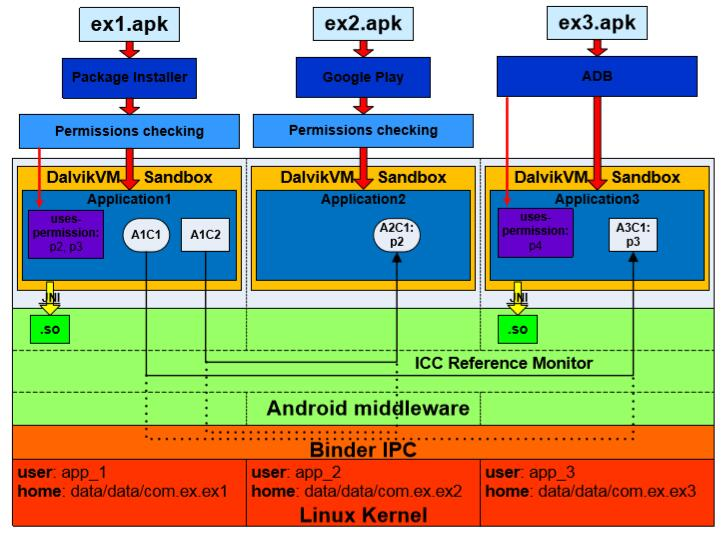

# 第二章 Android Linux 内核层安全

> 来源：[Yury Zhauniarovich | Publications](http://www.zhauniarovich.com/pubs.html)

> 译者：[飞龙](https://github.com/)

> 协议：[CC BY-NC-SA 4.0](http://creativecommons.org/licenses/by-nc-sa/4.0/)

作为最广为人知的开源项目之一，Linux 已经被证明是一个安全，可信和稳定的软件，全世界数千人对它进行研究，攻击和打补丁。 不出所料，Linux 内核是 Android 操作系统的基础[3]。 Android 不仅依赖于 Linux 的进程，内存和文件系统管理，它也是 Android 安全架构中最重要的组件之一。 在 Android 中，Linux 内核负责配置应用沙盒，以及规范一些权限。

## 2.1 应用沙盒

让我们考虑一个 Android 应用安装的过程。 Android 应用以 Android 软件包（`.apk`）文件的形式分发。 一个包由 Dalvik 可执行文件，资源，本地库和清单文件组成，并由开发者签名来签名。 有三个主要媒介可以在 Android 操作系统的设备上安装软件包：

+   Google Play
+   软件包安装程序
+   adb install 工具

Google Play 是一个特殊的应用，它为用户提供查找由第三方开发人员上传到市场的应用，以及安装该应用的功能。虽然它也是第三方应用，但 Google Play 应用（因为使用与操作系统相同的签名进行签名）可访问 Android 的受保护组件，而其他第三方应用则缺少这些组件。如果用户从其他来源安装应用，则通常隐式使用软件包安装程序。此系统应用提供了用于启动软件包安装过程的界面。由 Android 提供的`adb install`工具主要由第三方应用开发人员使用。虽然前两个媒介需要用户在安装过程中同意权限列表，但后者会安静地安装应用。这就是它主要用于开发工具的原因，旨在将应用安装在设备上进行测试。该过程如图 2.1 的上半部分所示。此图显示了 Android 安全体系结构的更详细的概述。我们将在本文中参考它来解释这个操作系统的特性。

在 Linux 内核层配置应用沙箱的过程如下。 在安装过程中，每个包都会被分配一个唯一的用户标识符（UID）和组标识符（GID），在设备的应用生命周期内不会更改。 因此，在 Android 中每个应用都有一个相应的 Linux 用户。 用户名遵循格式`app_x`，并且该用户的 UID 等于`Process.FIRST_APPLICATION_UID + x`，其中`Process.FIRST_APPLICATION_UID`常量对应于`10000`。例如，在图 2.1 中，`ex1.apk`包在安装期间获得了用户名`app 1`，UID 等于 `10001`。

在 Linux 中，内存中的所有文件都受 Linux 自定义访问控制（DAC）的约束。访问权限由文件的创建者或所有者为三种用户类型设置：文件的所有者，与所有者在同一组中的用户和所有其他用户。对于每种类型的用户，分配读，写和执行（`r-w-x`）权限的元组。因此，因为每个应用都有自己的 UID 和 GID，Linux 内核强制应用在自己的隔离地址空间内执行。除此之外，应用唯一的 UID 和 GID 由 Linux 内核使用，以实现不同应用之间的设备资源（内存，CPU 等）的公平分离。安装过程中的每个应用也会获得自己的主目录，例如`/data/data/package_name`，其中`package_name`是 Android 软件包的名称，例如`com.ex.ex1`，在 Android 中，这个文件夹是内部存储目录，其中应用将私有数据放在里面。分配给此目录的 Linu x 权限只允许“所有者”应用写入并读取此目录。有一些例外应该提到。使用相同证书签名的应用能够在彼此之间共享数据，可以拥有相同的 UID 或甚至可以在相同的进程中运行。

这些架构决策在 Linux 内核层上建立了高效的应用沙箱。 这种类型的沙箱很简单，并基于 Linux 可选访问控制模型（DAC）的验证。 幸运的是，因为沙盒在 Linux 内核层上执行，本地代码和操作系统应用也受到本章[3]中所描述的这些约束的约束。
