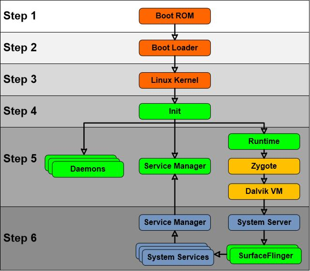

# 第三章 Android 本地用户空间层安全

> 来源：[Yury Zhauniarovich | Publications](http://www.zhauniarovich.com/pubs.html)

> 译者：[飞龙](https://github.com/)

> 协议：[CC BY-NC-SA 4.0](http://creativecommons.org/licenses/by-nc-sa/4.0/)

本地用户空间层在 Android 操作系统的安全配置中起到重要作用。 不理解在该层上发生了什么，就不可能理解在系统中如何实施安全架构决策。 在本章中，我们的主题是 Android 引导过程和文件系统特性的，并且描述了如何在本地用户空间层上保证安全性。

## 3.1 Android 引导过程

要了解在本地用户空间层上提供安全性的过程，首先应考虑 Android 设备的引导顺序。 要注意，在第一步中，这个顺序可能会因不同的设备而异，但是在 Linux 内核加载之后，过程通常是相同的。 引导过程的流程如图 3.1 所示。



图 3.1：Android 启动顺序

当用户打开智能手机时，设备的 CPU 处于未初始化状态。在这种情况下，处理器从硬连线地址开始执行命令。该地址指向 Boot ROM 所在的 CPU 的写保护存储器中的一段代码（参见图 3.1 中的步骤 1）。代码驻留在 Boot ROM 上的主要目的是检测 Boot Loader（引导加载程序）所在的介质[17]。检测完成后，Boot ROM 将引导加载程序加载到内存中（仅在设备通电后可用），并跳转到引导 Boot Loader 的加载代码。反过来，Boot Loader 建立了外部 RAM，文件系统和网络的支持。之后，它将 Linux 内核加载到内存中，并将控制权交给它。 Linux 内核初始化环境来运行 C 代码，激活中断控制器，设置内存管理单元，定义调度，加载驱动程序和挂载根文件系统。当内存管理单元初始化时，系统为使用虚拟内存以及运行用户空间进程[17]做准备。实际上，从这一步开始，该过程就和运行 Linux 的台式计算机上发生的过程没什么区别了。

第一个用户空间进程是`init`，它是 Android 中所有进程的祖先。 该程序的可执行文件位于 Android 文件系统的根目录中。 清单 3.1 包含此可执行文件的主要部分。 可以看出，`init`二进制负责创建文件系统基本条目（7 到 16 行）。 之后（第 18 行），程序解析`init.rc`配置文件并执行其中的命令。

```c
 1 int main( int argc, char **argv ) 
 2 { 
 3   ...
 4   if (!strcmp (basename( argv[0] ), ”ueventd”) ) 
 5     return ueventd_main ( argc, argv ) ; 
 6   ...
 7   mkdir(”/dev”, 0755) ; 
 8   mkdir(”/proc”, 0755) ; 
 9   mkdir(”/sys”, 0755) ; 
10 
11   mount(”tmpfs”, ”/dev”, ”tmpfs”, MS_NOSUID, ”mode=0755”) ; 
12   mkdir(”/dev/pts”, 0755) ; 
13   mkdir(”/dev/socket”, 0755) ; 
14   mount(”devpts”, ”/dev/pts”, ”devpts”, 0, NULL) ; 
15   mount(”proc”, ”/proc”, ”proc”, 0, NULL) ; 
16   mount(”sysfs”, ”/sys”, ”sysfs”, 0, NULL) ; 
17   ... 
18   init_parseconfig_file(”/init.rc”) ; 
19   ... 
20 }
```

代码 3.1：`init`程序源码

`init.rc`配置文件使用一种称为 Android Init Language 的语言编写，位于根目录下。 这个配置文件可以被想象为一个动作列表（命令序列），其执行由预定义的事件触发。 例如，在清单 3.2 中，`fs`（行 1）是一个触发器，而第 4 - 7 行代表动作。 在`init.rc`配置文件中编写的命令定义系统全局变量，为内存管理设置基本内核参数，配置文件系统等。从安全角度来看，更重要的是它还负责基本文件系统结构的创建，并为创建的节点分配所有者和文件系统权限。

```
1 on fs 
2   # mount mtd partitions 
3   # Mount /system rw first to give the filesystem a chance to save a checkpoint 
4   mount yaffs2 mtd@system /system 
5   mount yaffs2 mtd@system /system ro remount 
6   mount yaffs2 mtd@userdata /data nosuid nodev 
7   mount yaffs2 mtd@cache /cache nosuid nodev
```

代码 3.2：模拟器中的`fs`触发器上执行的动作列表

此外，`init`程序负责在 Android 中启动几个基本的守护进程和进程（参见图 3.1 中的步骤 5），其参数也在`init.rc`文件中定义。 默认情况下，在 Linux 中执行的进程以与祖先相同的权限（在相同的 UID下）运行。 在 Android 中，`init`以 root 权限（`UID == 0`）启动。 这意味着所有后代进程应该使用相同的 UID 运行。 幸运的是，特权进程可以将其 UID 改变为较少特权的进程。 因此，`init`进程的所有后代可以使用该功能来指定派生进程的 UID 和 GID（所有者和组也在`init.rc`文件中定义）。

第一个守护进程派生于`init`进程，它是`ueventd`守护进程。 这个服务运行自己的`main`函数（参见清单 3.1 中的第 5 行），它读取`ueventd.rc`和`ueventd.[device name].rc`配置文件，并重放指定的内核`uevent_hotplug`事件。 这些事件设置了不同设备的所有者和权限（参见清单 3.3）。 例如，第 5 行显示了如何设置文件系统对`/ dev/cam`设备的权限，2.2 节中会涉及这个例子。 之后，守护进程等待监听所有未来的热插拔事件。

ueventd.rc

```
1 ...
2 /dev/ashmem 0666 root root 
3 /dev/binder 0666 root root 
4 ...
5 /dev/cam 0660 root camera 
6 ...
```

代码 3.3：`ueventd.rc`文件

由`init`程序启动的核心服务之一是`servicemanager`（请参阅图 3.1 中的步骤 5）。 此服务充当在 Android 中运行的所有服务的索引。 它必须在早期阶段可用，因为以后启动的所有系统服务都应该有可能注册自己，从而对操作系统的其余部分可见[19]。
